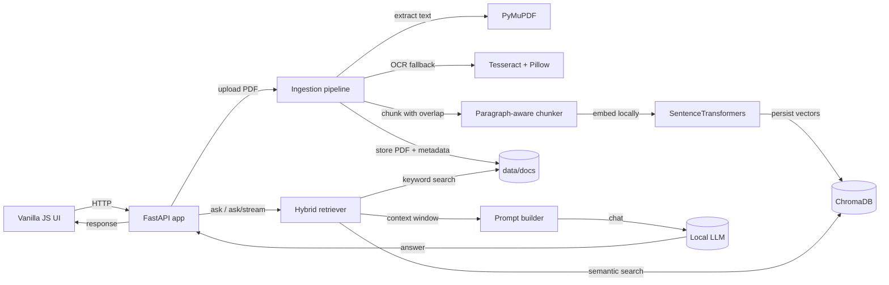

# Local Letter RAG

Local Letter RAG is a fully on-device retrieval-augmented generation system for PDF letters and formal documents. It is designed to solve a practical problem: most document Q&A tools either send sensitive content to external APIs or lose the document’s structure when generating answers. This project keeps the entire workflow local, preserves the source document’s layout, and returns grounded responses with citations from the indexed file.

The application is built as a small but complete production-style stack: FastAPI for the backend, ChromaDB for persistence, SentenceTransformers for local embeddings, PyMuPDF with OCR fallback for extraction, and Ollama for local inference.

## What It Delivers

- Upload one or more PDFs and index them locally.
- Ask questions against a specific document or the latest uploaded document.
- Use hybrid retrieval: vector search plus keyword search over cached chunks.
- Stream responses from a local Ollama model or request a full response at once.
- Preserve letter/formal-document structure with a strict system prompt.
- Keep all document data on disk under `data/` instead of relying on external services.

## Problem Statement

Document assistants are useful only when they answer accurately, cite the source, and respect document structure. In practice, many implementations struggle with one or more of the following:

- They depend on cloud APIs, which is a poor fit for sensitive or confidential documents.
- They miss exact phrases, names, or formatting because retrieval is purely semantic.
- They degrade badly on scanned PDFs or image-heavy documents.
- They generate fluent text that does not preserve the template or section order of the source document.

This project addresses those issues by combining local extraction, hybrid retrieval, and constrained generation in a single offline-ready application.

## Solution Overview

The app ingests a PDF, extracts text page by page, falls back to OCR when text is sparse, chunks the content with overlap, embeds the chunks, and stores them in a persistent ChromaDB collection. At question time, it retrieves relevant chunks using both semantic similarity and keyword matching, deduplicates the context, and sends the final prompt to Ollama. The result is a local RAG pipeline optimized for formal documents and letters.

## Demo Video

> Click here to watch the demo video: **[Watch the demo](https://your-demo-link-here)**


## Architecture



## Implementation Details

The repository is intentionally small, but the implementation includes several engineering decisions that matter in real systems:

- `app/ingest.py` extracts text with PyMuPDF and automatically uses Tesseract OCR when a page contains too little text.
- `app/vector_store.py` persists normalized embeddings in ChromaDB using cosine similarity.
- `app/main.py` combines vector search with keyword search over cached chunk files to improve recall for exact names, dates, and phrases.
- `app/main.py` also enforces a formal-document system prompt so generated answers preserve the source structure instead of improvising a new one.
- `app/main.py` limits conversational history to the most recent turns and includes repetition guards for streaming output.
- `app/ui.html` is a lightweight single-page interface with upload, document selection, streaming Q&A, and source display.

### Why These Choices Matter

- Hybrid retrieval is more robust than embeddings alone for legal-style letters, forms, and administrative documents.
- OCR fallback makes the system usable on scanned PDFs instead of only digitally generated files.
- Persistent storage lets the app behave like a real tool, not a demo that loses state on restart.
- Structure-preserving prompting is critical when the goal is to generate or explain formal correspondence.
- Streaming responses improve perceived responsiveness for longer outputs.

## Repository Structure

```text
README.md
requirements.txt
app/
	__init__.py
	config.py          # environment-driven configuration
	ingest.py          # PDF extraction, OCR fallback, chunking
	llm.py             # Ollama chat + streaming client
	main.py            # FastAPI routes, retrieval, sessions, orchestration
	server.py          # compatibility ASGI entrypoint
	ui.html            # browser UI for upload and chat
	vector_store.py    # ChromaDB client and embedding persistence
data/
	chroma/            # persistent vector store
	docs/              # uploaded PDFs, registry, cached chunks
```

## Usage Guide

1. Upload a PDF from the UI or call `POST /upload`.
2. Wait for indexing to complete. The document will be stored under `data/docs/` and embedded into `data/chroma/`.
3. Ask a question from the UI, `POST /ask`, or `GET /ask/stream`.
4. Optionally set a `doc_id` to target one document explicitly. If omitted, the app uses the most recent uploaded document.
5. Review the returned sources to see which chunks informed the answer.

### API Endpoints

- `GET /` returns the HTML UI.
- `GET /health` checks Ollama, ChromaDB, and indexed document count.
- `GET /docs` lists indexed documents and chunk counts.
- `POST /upload` and `POST /ingest` upload and index a PDF.
- `POST /ask` returns a full JSON answer.
- `GET /ask/stream` streams the answer as NDJSON.
- `DELETE /reset` removes indexed documents and clears the vector store.
- `DELETE /session/{session_id}` clears one chat session from memory.

## Configuration

The application is environment-driven. The most important settings are:

- `OLLAMA_URL` controls the local Ollama chat endpoint.
- `OLLAMA_MODEL` sets the generation model.
- `EMBED_MODEL_NAME` sets the local embedding model.
- `MAX_CHUNK_CHARS` and `CHUNK_OVERLAP` control chunking behavior.
- `TOP_K`, `KW_TOP_K`, and `MAX_CONTEXT_CHUNKS` tune retrieval depth.
- `OCR_MIN_TEXT_CHARS` enables OCR fallback for low-text pages.
- `REQUEST_TIMEOUT` controls request timeout behavior.

Default values live in `app/config.py`.

## Design Notes

- The app stores a registry in `data/docs/registry.json` to keep track of uploaded files and document IDs.
- Each document also gets a chunk cache at `data/docs/<doc_id>/chunks.json` so keyword search works without reprocessing the PDF.
- Session history is in memory only, which keeps the implementation simple and avoids pretending to be a full chat platform.
- The system prompt is intentionally strict because the best response for formal documents is usually fidelity, not creativity.

## Real-World Use Cases

This project is relevant anywhere local, document-grounded generation matters:

- HR and operations teams reviewing internal letters, notices, and forms.
- Legal or compliance workflows where data should remain on-device.
- Support and admin teams answering questions from procedural PDFs.
- AI/ML teams demonstrating practical RAG design, retrieval quality tradeoffs, and local inference patterns.

## Why This Project Stands Out

This is not a toy chatbot wrapper. It demonstrates full-stack ownership across ingestion, retrieval, model orchestration, persistence, and UI delivery. The codebase shows pragmatic engineering choices: local-first deployment, OCR resilience, hybrid retrieval, source tracking, stream handling, and a clean operator-facing interface.

For a recruiter evaluating AI or software engineering ability, this repository shows that the system is designed end to end, not just stitched together from APIs.

## Notes

- The app can run fully offline after the embedding model and Ollama model are available locally.
- The default model in the codebase is `Qwen2.5:1.5b`.
- The legacy entrypoint `app.server:app` is preserved for compatibility.

---

Copyright © 2026 Anup806. All rights reserved.
