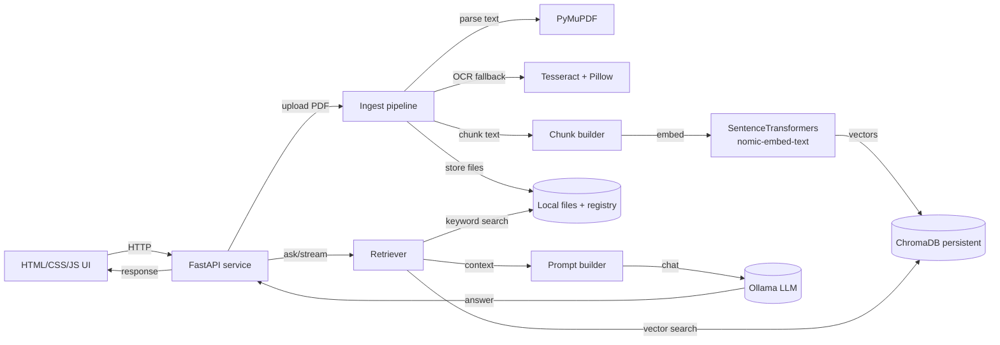

# Local Document Assistant (Offline)

Fully local PDF document assistant that runs on your machine with:
- FastAPI backend
- Ollama (qwen2.5:0.5b by default) for generation
- ChromaDB for vector search
- Local Python embeddings via `nomic-embed-text`

## What It Does

- Upload PDFs and build a local vector index.
- Retrieve answers using vector search plus keyword search.
- Stream responses from a local LLM.
- Preserve letter/document structure using a strict system prompt.

## Architecture (Mermaid)



## Setup

1) Create and activate a virtual environment.
2) Install requirements:

```
pip install -r requirements.txt
```

3) Make sure Ollama is running and the model is available:

```
ollama pull qwen2.5:0.5b
```

4) (Optional) Install Tesseract OCR if you want OCR fallback on scanned PDFs.

5) Start the server:

```
uvicorn app.main:app --host 127.0.0.1 --port 8000 --reload
```

6) Open the UI:

```
http://127.0.0.1:8000
```

## Usage

- Upload a PDF with the UI (or call `POST /upload`).
- Ask questions using the UI (or `POST /ask` / `GET /ask/stream`).
- The app stores PDFs under `data/docs/` and vectors under `data/chroma/`.

## API Endpoints

- `GET /` UI
- `GET /health` basic Ollama/Chroma status
- `GET /docs` list indexed documents
- `POST /upload` or `POST /ingest` upload and index a PDF
- `POST /ask` retrieve and generate a full response
- `GET /ask/stream` stream tokens as NDJSON
- `DELETE /reset` clear documents and vectors
- `DELETE /session/{session_id}` clear chat history

## Notes

- The embedding model downloads on first run. After that, the app can run offline.
- The registry is stored at `data/docs/registry.json`.
- A per-document cache of chunks is stored at `data/docs/<doc_id>/chunks.json`.
- Session history is in-memory only and resets when the server restarts.

## Environment Variables

- `CHROMA_COLLECTION` (default: documents)
- `OLLAMA_URL` (default: http://localhost:11434/api/chat)
- `OLLAMA_MODEL` (default: qwen2.5:0.5b)
- `OLLAMA_NUM_PREDICT` (default: 640)
- `OLLAMA_REPEAT_PENALTY` (default: 1.12)
- `OLLAMA_REPEAT_LAST_N` (default: 128)
- `OLLAMA_TOP_P` (default: 0.9)
- `OLLAMA_TOP_K` (default: 40)
- `EMBED_MODEL_NAME` (default: nomic-ai/nomic-embed-text-v1.5)
- `MAX_CHUNK_CHARS` (default: 1200)
- `CHUNK_OVERLAP` (default: 150)
- `TOP_K` (default: 8)
- `KW_TOP_K` (default: 6)
- `MAX_CONTEXT_CHUNKS` (default: 10)
- `REQUEST_TIMEOUT` (default: 180)
- `OCR_MIN_TEXT_CHARS` (default: 100)
