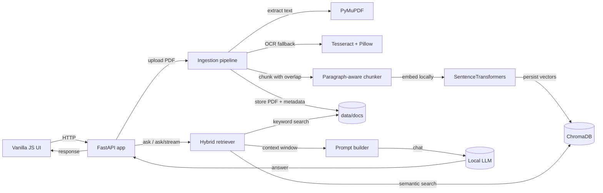

<!--
& ".\.venv\Scripts\python.exe" -m uvicorn app.server:app --host 127.0.0.1 --port 8000 --reload  
-->
# Local Letter RAG

A fully offline retrieval-augmented generation system for PDF letters and formal documents. All document processing, embedding, and inference runs locally — no cloud API required. The system returns grounded answers with inline citations while preserving the source document's structure.

---

## Demo

▶ [Watch the demo](https://youtu.be/95QFCS6z438)

---

## Features

- Upload one or more PDFs and index them locally
- Hybrid retrieval: semantic vector search (ChromaDB) combined with BM25 keyword search
- Cross-encoder reranking for improved precision on exact names, dates, and phrases
- OCR fallback via Tesseract for scanned or image-heavy PDFs
- Inline citations enforced in every generated answer
- Streaming and non-streaming response modes
- Structure-preserving system prompt for formal document outputs
- Full persistence under `data/` — state survives restarts
- Runs entirely offline after initial model download

---

## Architecture


```mermaid
flowchart LR
    UI[Vanilla JS UI] -->|HTTP| API[FastAPI app]

    API -->|upload PDF| Ingest[Ingestion pipeline]
    Ingest -->|extract text| PDF[PyMuPDF]
    Ingest -->|OCR fallback| OCR[Tesseract + Pillow]
    Ingest -->|chunk with overlap| Chunker[Paragraph-aware chunker]
    Chunker -->|embed locally| Embedder[SentenceTransformers]
    Embedder -->|persist vectors| Chroma[(ChromaDB)]
    Ingest -->|store PDF + metadata| Docs[(data/docs)]

    API -->|ask / ask/stream| Retriever[Hybrid retriever]
    Retriever -->|semantic search| Chroma
    Retriever -->|keyword search| Docs
    Retriever -->|context window| Prompt[Prompt builder]
    Prompt -->|chat| Ollama[(Local LLM)]
    Ollama -->|answer| API
    API -->|response| UI
```

---

## Repository Structure

```text
README.md
requirements.txt
app/
    __init__.py
    config.py          # environment-driven configuration
    ingest.py          # PDF extraction, OCR fallback, chunking
    llm.py             # Ollama chat + streaming client
    main.py            # FastAPI routes, retrieval, sessions, orchestration
    server.py          # ASGI entrypoint
    ui.html            # browser UI for upload and chat
    vector_store.py    # ChromaDB client and embedding persistence
data/
    chroma/            # persistent vector store
    docs/              # uploaded PDFs, registry, cached chunks
```

---

## Setup

```bash
git clone https://github.com/Anup806/local-letter-RAG.git
cd local-letter-RAG
pip install -r requirements.txt

# Install ollama on desktop
# Pull the local LLM
ollama pull qwen2.5:1.5b
```

Start the server:

```bash
.\.venv\Scripts\python.exe -m uvicorn app.server:app --host 127.0.0.1 --port 8000 --reload
```

Open `http://127.0.0.1:8000` in your browser.

---

## API Endpoints

| Method | Endpoint | Description |
|--------|----------|-------------|
| `GET` | `/` | Browser UI |
| `GET` | `/health` | Checks Ollama, ChromaDB, and document count |
| `GET` | `/docs` | Lists indexed documents and chunk counts |
| `POST` | `/upload` | Upload and index a PDF |
| `POST` | `/ask` | Full JSON answer |
| `GET` | `/ask/stream` | Streaming answer (NDJSON) |
| `DELETE` | `/reset` | Clear all indexed documents and vector store |
| `DELETE` | `/session/{session_id}` | Clear one chat session |

---

## Configuration

All settings are environment-driven. Key variables:

| Variable | Description |
|----------|-------------|
| `OLLAMA_URL` | Local Ollama chat endpoint |
| `OLLAMA_MODEL` | Generation model (default: `qwen2.5:1.5b`) |
| `EMBED_MODEL_NAME` | Local embedding model |
| `MAX_CHUNK_CHARS` | Max characters per chunk |
| `CHUNK_OVERLAP` | Overlap between consecutive chunks |
| `TOP_K` | Number of vector search results |
| `KW_TOP_K` | Number of keyword search results |
| `MAX_CONTEXT_CHUNKS` | Max chunks passed to prompt |
| `OCR_MIN_TEXT_CHARS` | Threshold to trigger OCR fallback |

Defaults are defined in `app/config.py`.

---

## Implementation Notes

- `app/ingest.py` — extracts text with PyMuPDF; falls back to Tesseract when a page has insufficient text
- `app/vector_store.py` — persists normalized embeddings in ChromaDB using cosine similarity
- `app/main.py` — combines vector search with BM25 and cross-encoder reranking; enforces inline citations and a formal-document system prompt; limits session history to recent turns with repetition guards
- `data/docs/registry.json` — tracks uploaded file metadata and document IDs
- `data/docs/<doc_id>/chunks.json` — cached chunk data for keyword search without reprocessing
- Session history is in-memory only; no external state store required

---

Copyright © 2026 Anup806. All rights reserved.
